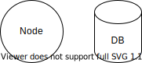

# Using drawio diagrams in Markdown

[Blog post from Extension dev](https://dev.to/hediet/create-diagrams-in-vs-code-with-draw-io-32pd)

## Why

As a developer
I want to Keep documentation close to my code
So that it is easy to find when I need it.

In my experience it's hard to create, update and find good documentation geared towards developers, especially when there's any kind of drawings involved.
Sometimes it's a word document, sometimes it's a google document, sometimes it's a markdown with a png created in Miro, drawio or LucidChart.

## Solution

Use Markdown with drawio diagrams embedded in png:s.

- Stored in code repo
- One source of truth
- Visible in VS Code and GitHub/GitLab browser view.

## How

1. Install Visual Studio Code, then the unofficial [Draw.IO Integration](https://marketplace.visualstudio.com/items?itemName=hediet.vscode-drawio)
2. Create a new file named `example.drawio.png`
3. Open `example.drawio.png`, the extension automatically starts up drawio in VS Code.
4. Use in markdown at will:  
5. Commit in repo as any documentation.

The drawio xml is stored in the png/svg.
