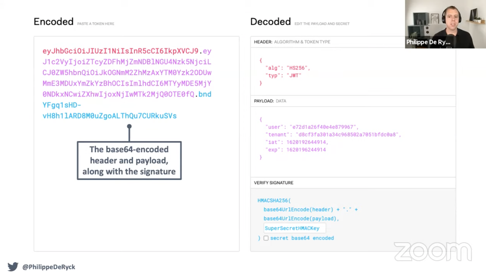
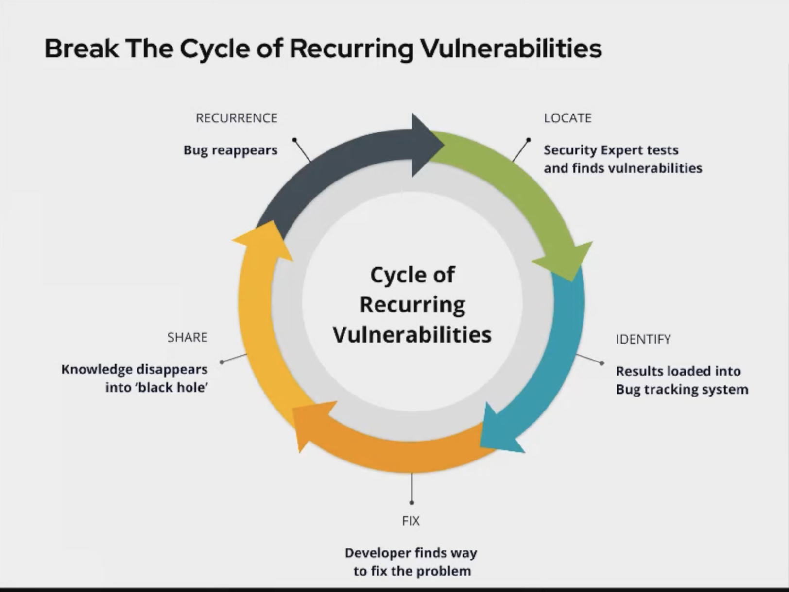
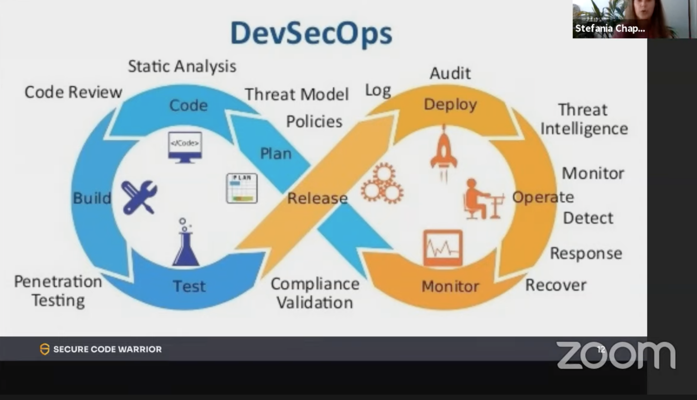
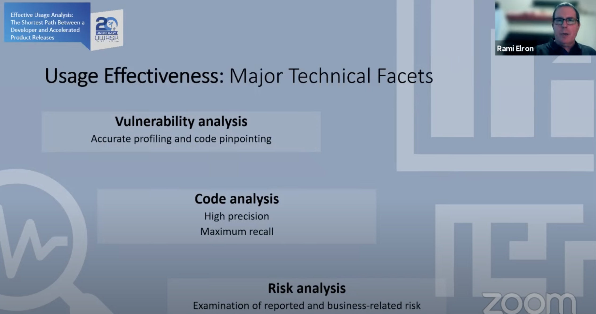
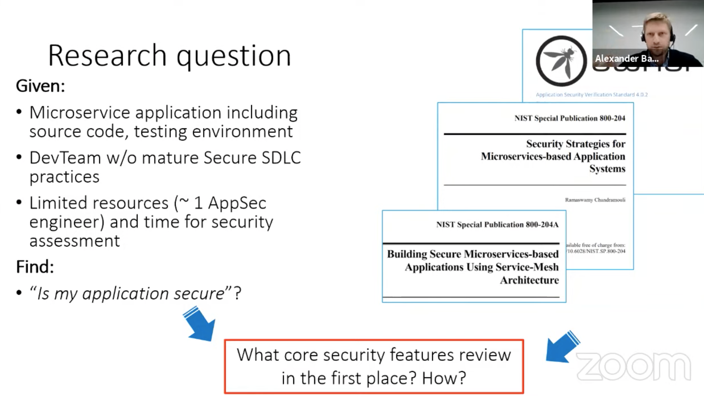
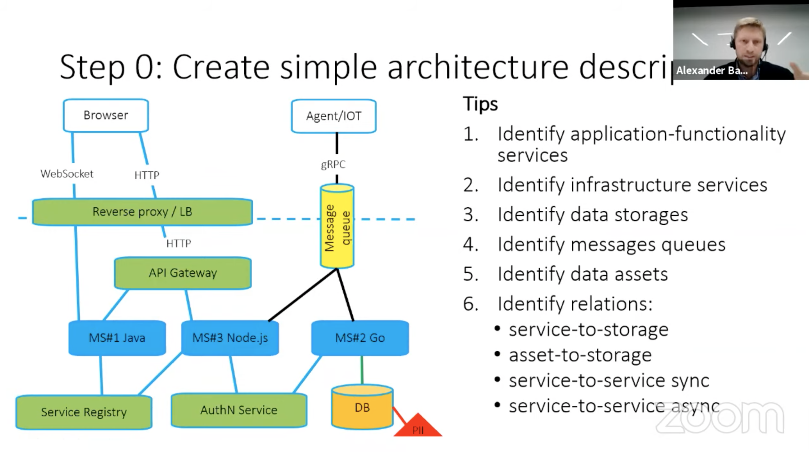

# Owasp 20 years

[Agenda](https://owasp20thanniversaryevent20.sched.com/)

## Watch:
- <https://owasp20thanniversaryevent20.sched.com/event/lboO/owasp-top-10-privacy-risks-2021>

## Apssec is to hard!
<https://owasp20thanniversaryevent20.sched.com/event/mudG/appsec-is-too-hard>
Philippe De Ryck

### Top tips

- [semgrep](https://semgrep.dev/docs/language-support/)
- DOMPurify.sanitize(html)
- Encapsulate security behaviour in libraries

The road to appsec hell is paved with good intentions
All devs wants to create secure apps, but still fail. Why?

### JWT
header, payload, verify signature

Pros
- Not xml
- (scaling)

Cons
- Have security issues
  - alg: none - is allowed, and allows to skip verify signature if lib use. ie jwts::parse 
  - alg: NoNe, alg: NONe, alg: nOnE
  - alg:none must be rejected on serverside!

Article: "Apache pulsar bug allowed account takeovers in certain configurations"

jswon web token attacker
[It has been 60 days since the last alg=none JWT vulnerability](https://www.howmanydayssinceajwtalgnonevuln.com/#:~:text=It%20has%20been%2057%20days,for%20user%20authentication%20and%20authorisation.)

What is needed? Minimum:
- Choosing the JWT signature scheme
  - digital signatures!
- Deciding on the signing algorithm
  - PS256! Good libs has support.
- Verifying the validity of the JWT
  - corretly verifying the signature
  - checking the timestamps(nbf and exp)
  - checking the issuer and audience claims (iss and aud)

  But probably also
  - Using key identifiers to support key rotation
  - using explicit jwt typing to avoid token confusion attacks

#### Suggestion

Help developers do the right thing!
  Offer the right abstractions to developers.

### React

Cross site scripting
Escapes values embedded in JSX before rendering them
dangerouslySetInnerHTML
  - calling something dangerous doesn't prevent devs from using it

**DOMPurify**, using whitelisting to sanitize html/js data
[semgrep](https://semgrep.dev/docs/language-support/)

## How Security, Development & Testing can work together to stop the same recurring vulnerabilities appearing in the OWASP Top 10
<https://owasp20thanniversaryevent20.sched.com/event/lbua/how-security-development-testing-can-work-together-to-stop-the-same-recurring-vulnerabilities-appearing-in-the-owasp-top-10>

OWASP top 10 is different this year
- Insecure Design is new at #4

## OWASP top 10 privacy risks
<https://owasp20thanniversaryevent20.sched.com/event/lboO/owasp-top-10-privacy-risks-2021>

[OWASP top 10 privacy risks List](https://owasp.org/www-project-top-10-privacy-risks/)

## Effective Usage Analysis: The Shortest Path Between a Developer and Accelerated Product Releases

<https://owasp20thanniversaryevent20.sched.com/event/lhAx/effective-usage-analysis-the-shortest-path-between-a-developer-and-accelerated-product-releases>

Vulnerability priorization is hard!
- Needs structured prioritization
- Consider effective factors
- Objective justification for prioritization

Analysis of Usage Effectiveness
- Vulnerability != Risk
  - If your code is not using OSS or lib in vulnerability affected way, then it's not a risk.

**Study: 73.8% of reported vulnerabilities for Java projects OSS components analyzed as ineffective**

## Attacking the microservice systems: methods and practical tips

<https://owasp20thanniversaryevent20.sched.com/event/lbq1/attacking-the-microservice-systems-methods-and-practical-tips>

Alexander Barabanov

[Microservice based security arch doc cheat sheet](https://cheatsheetseries.owasp.org/cheatsheets/Microservices_based_Security_Arch_Doc_Cheat_Sheet.html)
